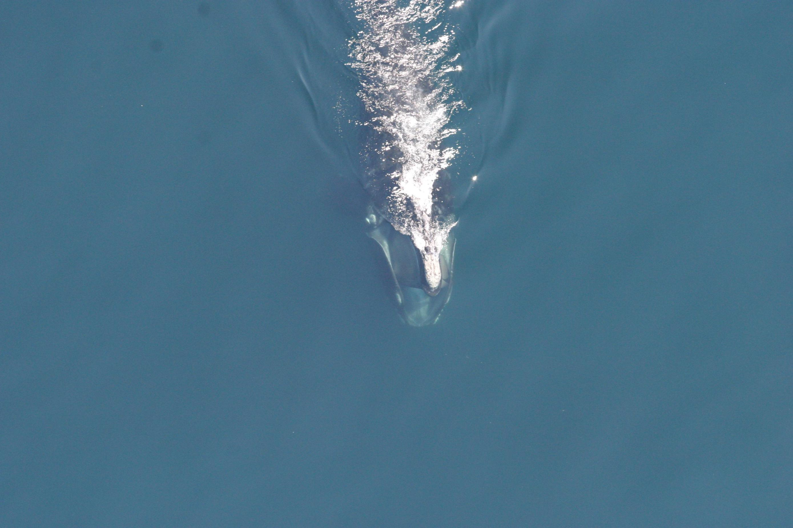
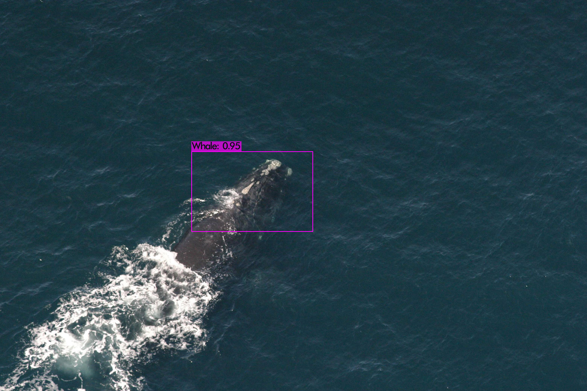
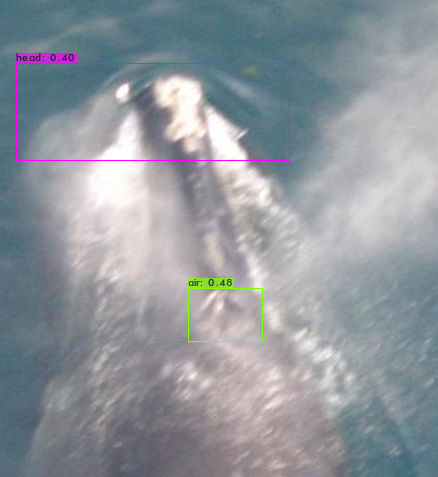
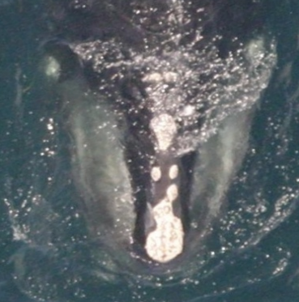

# Reasearch Work of Master's one: whale-Net - Deep Learning challenge on whale detection and recognition of individuals
There are approximately 450 living individuals of the right whale species. The main challenge for scientists is to be able to recognize them from drones or aerial images. Given a picture of whale like this
 
Given a picture of whale like this:

The challenge is to output the correct id of the whale in the picture.
We have to deal with unbalanced data given the fact that there is sometimes only one picture for an individual and 40 for another.
 

## Three Developpment steps
#### First we builded an head localizer with the help of a tiny Yolov3

 
Detecting the head on the global image example

#### Then an head aligner using Yolo again to detect small particular points on the head and homography calculation to do the alignment. 

Detecting particular points on the head

 

 

#### Finally we trained a CNN with an architecture very similar to FaceNet on standardized photos of whales to find the right individuals. See [here] (https://github.com/hugomtr/whale-Net/tree/main/Training/FaceNet)

 
Correctly aligned image

 

For fursthermore information on the project you can check out the [project report](https://github.com/hugomtr/whale-Net/blob/main/TER_rapport.pdf)
